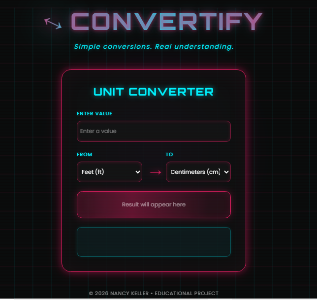

  

# ↔️ CONVERTIFY - Neon Edition

Welcome to **Convertify**! 🌟 This is a special unit converter project with a futuristic neon aesthetic, created to practice web development fundamentals while solving a nostalgic educational challenge.

---

## ✨ The Story Behind the Project

This project is a "reflection from the past." Back when I was learning English, I remember having classes about **temperature** and **height** (especially human height). We had to use formulas and do all the calculations "by hand" in our workbooks! 📝

Looking back at those lessons, I felt inspired to create my own unit converter. It’s a way to bridge my English learning journey with my current path as a **Systems Analysis and Development** student.

## 🛠️ Tech Stack & Learning Goals

The main goal of this project was to practice my growing skills in **HTML5, CSS3 & JS** :

* **JavaScript (The Logic):** This was the heart of the practice! I focused heavily on using `if` statements to handle all the different unit possibilities and ensuring the math logic was correct for each conversion.
* **AI Collaboration:** To give the project a "futuristic vibe," I used AI support to help craft the **Neon Theme** layout and the glowing CSS effects, making the learning process even more interactive.

## 🚀 Features

* **Length Conversion:** Feet, Centimeters, Meters, Inches, Kilometers, and Miles.
* **Weight Conversion:** Pounds and Kilograms.
* **Temperature Conversion:** Celsius and Fahrenheit.
* **Educational Insights:** Each conversion shows a small tip or explanation about why those units are used (e.g., explaining human height in the US).
* **Responsive Design:** Looks great on both desktops and mobile devices.

## 📸 Preview

> [!TIP]
> The layout features animated grid backgrounds, glowing orbs, and a retro scanline effect for that ultimate "cyberpunk" feel!

---

## 👩‍💻 About the Developer

I am a **Systems Analysis and Development student** passionate about learning how things work under the hood. This project represents my early steps in coding—it's simple, honest, and made with a lot of heart!

**© 2026 NANCY KELLER**
